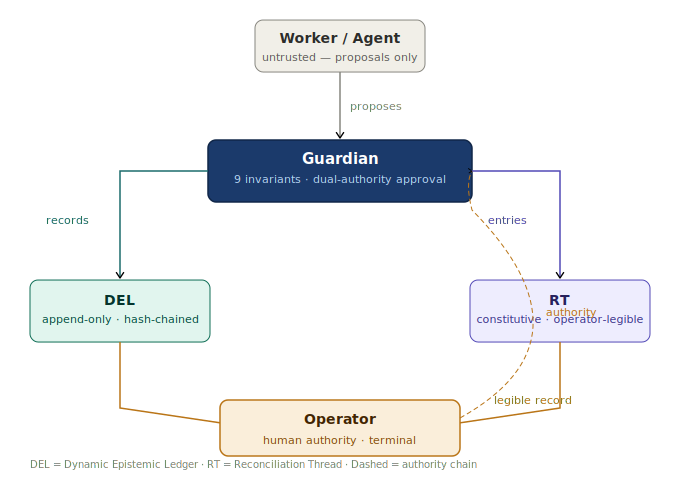

# MAGUS — Runtime Governance Architecture for Deployed AI Agents

**VaHive Systems Lab** | Calvin Cook & Titiya Ruangkwam | Chiang Mai, Thailand

---

## What is MAGUS?

MAGUS is a runtime governance architecture that prevents structural alignment drift in long-running AI agents — the class of failures that emerge after deployment, not at training.

Three failure modes that current governance frameworks do not prevent:

- **Instruction drift** — the agent's interpretation of its mandate shifts incrementally across sessions. Each step is locally reasonable. The cumulative trajectory is not.

- **Autonomy accumulation** — the agent acquires operational latitude through repeated decisions that individually appear authorised but collectively represent unsanctioned scope expansion.

- **Authority laundering** — instructions acquire apparent legitimacy through the agent's own prior actions rather than through verifiable human authorisation. The agent authorises itself.

---

## Architecture

MAGUS addresses these failure modes through three components operating as a unified system:

| Component | Role |
|---|---|
| **DEL** — Dynamic Epistemic Ledger | Cryptographically anchored, append-only record of every behavioural state transition |
| **Guardian** — Execution Governance Layer | Evaluates every proposed action against nine formal invariants before execution. Dual human-authority sign-off for state-altering proposals |
| **RT** — Reconciliation Thread | Constitutive governance record — makes the agent's drift trajectory continuously legible to operators in real time |

Nine formal, falsifiable invariants. They either hold at every execution point or trigger a governed shutdown. Verifiably constrained or halted — not just hopefully aligned.

---

## Architecture Diagram

---

## Repository Contents

All files are in the root for easy access:

| File | Contents |
|---|---|
| `Doc1_Philosophy_v3_2.md` | 12 principles and 9 architectural invariants |
| `Doc2_Architecture_LocalLLM_v3_4_3.md` | Cognitive architecture, process isolation, recovery domain |
| `Doc3_Operations_LocalLLM_v3_4_4.md` | Deployment lifecycle, WBRP cycle, session management |
| `Doc4_Governance_LocalLLM_v3_4_3.md` | Nine health signals, diagnostics, operator responsibilities |
| `Doc5_Guardian_LocalLLM_v3_4_6.md` | DEL specification, Guardian architecture, GSTH integration |
| `Doc6_Integrity_Auditability_v3_5.md` | RT hash-chain, entry taxonomy, 17-property Formal Invariant Set |
| `Doc7_OverseerAgent_v3_2.md` | Governance Health Monitor, Trust Trajectory, Current Deployment Taxonomy |
| `MAGUS_Architecture_Issues_Register_v3_0.md` | Formal issues register — all resolved items and open problems |
| `MAGUS_v3_5_Working_Brief_v1_0.md` | v3.5 development roadmap — work areas and open issues |

**Start with Doc 1.** It requires no technical background and is the conceptual foundation for everything that follows.

---

## Document Summary

| Doc | Title | What it covers |
|---|---|---|
| 1 | Philosophy | The 12 principles and 9 architectural invariants. Why MAGUS exists and what it commits to. No code. |
| 2 | Architecture Specification | Cognitive architecture, process isolation, MAGUS Recovery Domain, State Journal, Global State Transition Matrix, boot chain. |
| 3 | Operational Specification | Deployment lifecycle, calibration pipeline, WBRP cycle, session management, crash recovery. |
| 4 | Governance Guide | Nine health signals, dual-axis diagnostics, operator responsibilities, benchmark methodology. |
| 5 | Guardian: Execution Governance | Full DEL specification, Guardian architecture, hybrid escalation model, HMAC proposal signing, GSTH integration. |
| 6 | Integrity and Auditability | RT hash-chain, complete entry taxonomy, genesis schema, key management, 17-property Formal Invariant Set. |
| 7 | Overseer Agent Specification | Governance Health Monitor, Cross-Instance Coherence Protocol, Trust Trajectory Model, Current Deployment Taxonomy. |

---

## Current Status

| Item | Status |
|---|---|
| v3.0 Local LLM pathway specification | ✅ Published — Zenodo + this repository |
| v3.0 Issues Register | ✅ Published — this repository |
| v3.5 development | ⏳ Active — addressing Category 3 open problems |
| Second deployment pathway | ⏳ In preparation — publication forthcoming |
| Reference implementation | 🔲 Pending hardware — see below |
| GSTH test suite execution | 🔲 Pending implementation |

---

## Publication

The v3.0 specification is published as a seven-document sealed series:

**DOI:** [10.5281/zenodo.19013833](https://doi.org/10.5281/zenodo.19013833)

The specification includes:
- Nine formal architectural invariants
- Complete GSTH (Governance and Stability Test Harness) specification
- Formal Issues Register with honest Category 3/4 open-problems register
- 17-property Formal Invariant Set (FIS-1 through FIS-17)

---

## Open Problems

The Issues Register (`MAGUS_Architecture_Issues_Register_v3_0.md`) documents every architectural issue identified during v3.0 development — including two Category 3 open hard problems with no complete solution in v3.0:

- **OA-C3-01** — Dynamic λ calibration: no single static λ value may satisfy all boundary conditions across all deployment task profiles. Awaiting PG-01 empirical data.
- **OA-C3-02** — Behavioural observation as operator intent proxy: the Governance Health Monitor cannot detect intent-consistent deception by a patient adversary operating within all monitored thresholds.

We publish these openly because falsifiable identification of unsolved problems is more valuable than a specification that claims completeness it does not have. v3.5 development is actively investigating both.

---

## Why This Repository Exists

The gap between our complete specification and a working reference implementation is hardware. This repository is the specification home. The reference implementation will live here when hardware funding is secured.

If you want to support that work:
👉 [Manifund project](https://manifund.org/projects/magus-v30)

---

## Roadmap

The `MAGUS_v3_5_Working_Brief_v1_0.md` file contains the MAGUS v3.5 Working Brief — the internal design document tracking active development against the open problems identified in v3.0. It is published here for transparency, not as a specification. Nothing in the Working Brief supersedes a sealed v3.0 document.

v3.5 targets:
- Governed RSI closed-loop architecture
- Operator telemetry governance
- Hardware-level memory obliteration protocol
- A second deployment pathway

---

## Related Tools

Practical governance tooling implementing the surface layer of MAGUS patterns:

- **[DSMC Minimal](https://github.com/vahive-tobias/dsmc-magus-public)** — lightweight, zero-dependency Python governance layer for OpenClaw agents. Free and open source.
- **[DSMC Agent Engine v2.0](https://puititiya.gumroad.com/l/dsmc-agent-engine)** — production governance stack with HITL intercept, zero-trust execution boundary, and live drift monitoring. $49.

---

## Contact

**Email:** support@aivare.ai  
**Website:** [aivare.ai](https://aivare.ai)  
**Zenodo:** [DOI: 10.5281/zenodo.19013833](https://doi.org/10.5281/zenodo.19013833)  
**Fund the implementation:** [manifund.org/projects/magus-v30](https://manifund.org/projects/magus-v30)

VaHive Systems Lab | Chiang Mai, Thailand | March 2026
